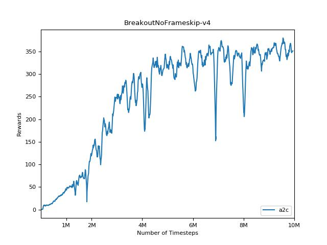
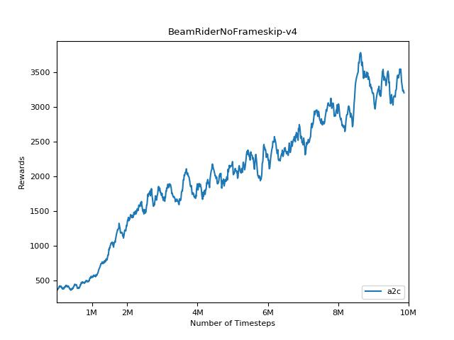
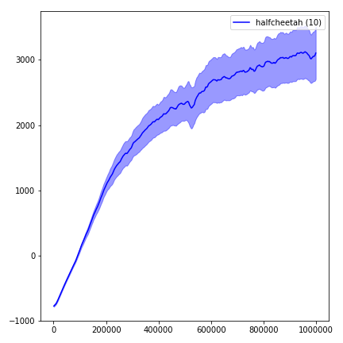
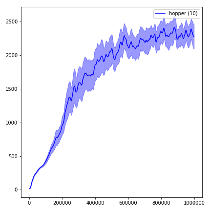
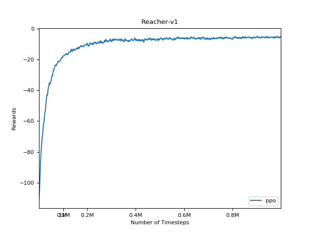
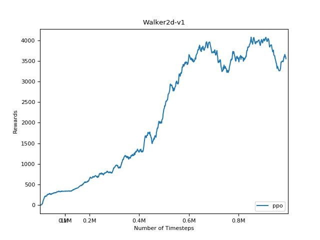
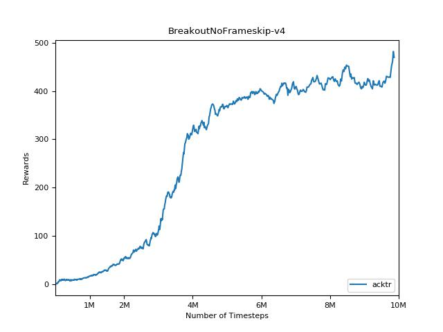
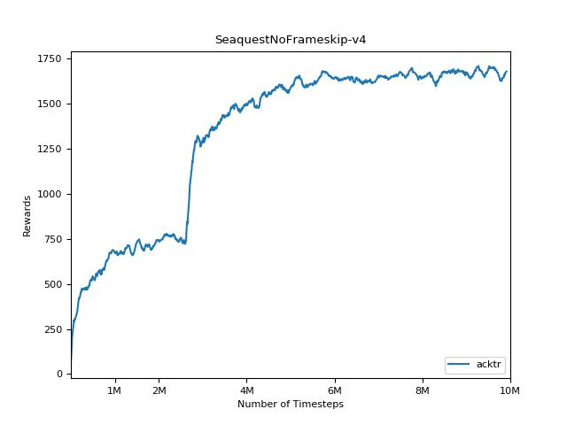
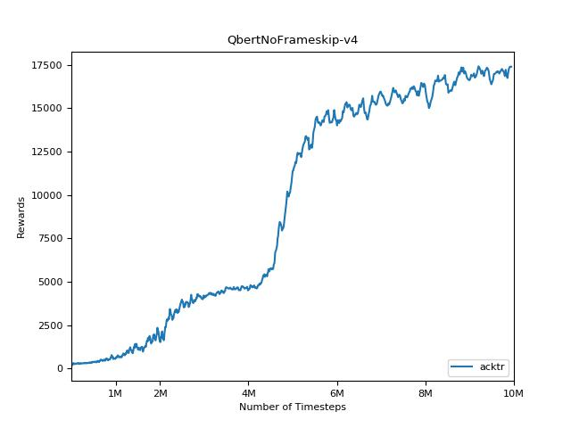
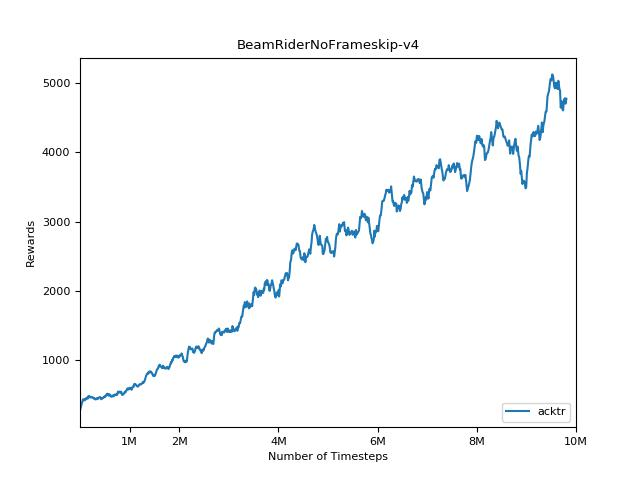

# pytorch-a2c-ppo-acktr

## Please use hyper parameters from this readme. With other hyper parameters things might not work (it's RL after all)!

This is a PyTorch implementation of
* Advantage Actor Critic (A2C), a synchronous deterministic version of [A3C](https://arxiv.org/pdf/1602.01783v1.pdf)
* Proximal Policy Optimization [PPO](https://arxiv.org/pdf/1707.06347.pdf)
* Scalable trust-region method for deep reinforcement learning using Kronecker-factored approximation [ACKTR](https://arxiv.org/abs/1708.05144)
* Generative Adversarial Imitation Learning [GAIL](https://arxiv.org/abs/1606.03476)

Also see the OpenAI posts: [A2C/ACKTR](https://blog.openai.com/baselines-acktr-a2c/) and [PPO](https://blog.openai.com/openai-baselines-ppo/) for more information.

This implementation is inspired by the OpenAI baselines for [A2C](https://github.com/openai/baselines/tree/master/baselines/a2c), [ACKTR](https://github.com/openai/baselines/tree/master/baselines/acktr) and [PPO](https://github.com/openai/baselines/tree/master/baselines/ppo1). It uses the same hyper parameters and the model since they were well tuned for Atari games.

Please use this bibtex if you want to cite this repository in your publications:

    @misc{pytorchrl,
      author = {Kostrikov, Ilya},
      title = {PyTorch Implementations of Reinforcement Learning Algorithms},
      year = {2018},
      publisher = {GitHub},
      journal = {GitHub repository},
      howpublished = {\url{https://github.com/ikostrikov/pytorch-a2c-ppo-acktr-gail}},
    }

## Supported (and tested) environments (via [OpenAI Gym](https://gym.openai.com))
* [Atari Learning Environment](https://github.com/mgbellemare/Arcade-Learning-Environment)
* [MuJoCo](http://mujoco.org)
* [PyBullet](http://pybullet.org) (including Racecar, Minitaur and Kuka)
* [DeepMind Control Suite](https://github.com/deepmind/dm_control) (via [dm_control2gym](https://github.com/martinseilair/dm_control2gym))

I highly recommend PyBullet as a free open source alternative to MuJoCo for continuous control tasks.

All environments are operated using exactly the same Gym interface. See their documentations for a comprehensive list.

To use the DeepMind Control Suite environments, set the flag `--env-name dm.<domain_name>.<task_name>`, where `domain_name` and `task_name` are the name of a domain (e.g. `hopper`) and a task within that domain (e.g. `stand`) from the DeepMind Control Suite. Refer to their repo and their [tech report](https://arxiv.org/abs/1801.00690) for a full list of available domains and tasks. Other than setting the task, the API for interacting with the environment is exactly the same as for all the Gym environments thanks to [dm_control2gym](https://github.com/martinseilair/dm_control2gym).

## Requirements

* Python 3 (it might work with Python 2, but I didn't test it)
* [PyTorch](http://pytorch.org/)
* [OpenAI baselines](https://github.com/openai/baselines)

In order to install requirements, follow:

```bash
# PyTorch
conda install pytorch torchvision -c soumith

# Baselines for Atari preprocessing
git clone https://github.com/openai/baselines.git
cd baselines
pip install -e .

# Other requirements
pip install -r requirements.txt
```

## Contributions

Contributions are very welcome. If you know how to make this code better, please open an issue. If you want to submit a pull request, please open an issue first. Also see a todo list below.

Also I'm searching for volunteers to run all experiments on Atari and MuJoCo (with multiple random seeds).

## Disclaimer

It's extremely difficult to reproduce results for Reinforcement Learning methods. See ["Deep Reinforcement Learning that Matters"](https://arxiv.org/abs/1709.06560) for more information. I tried to reproduce OpenAI results as closely as possible. However, majors differences in performance can be caused even by minor differences in TensorFlow and PyTorch libraries.

### TODO
* Improve this README file. Rearrange images.
* Improve performance of KFAC, see kfac.py for more information
* Run evaluation for all games and algorithms

## Visualization

In order to visualize the results use ```visualize.ipynb```.


## Training

### Atari
#### A2C

```bash
python main.py --env-name "PongNoFrameskip-v4"
```

#### PPO

```bash
python main.py --env-name "PongNoFrameskip-v4" --algo ppo --use-gae --lr 2.5e-4 --clip-param 0.1 --value-loss-coef 0.5 --num-processes 8 --num-steps 128 --num-mini-batch 4 --log-interval 1 --use-linear-lr-decay --entropy-coef 0.01
```

#### ACKTR

```bash
python main.py --env-name "PongNoFrameskip-v4" --algo acktr --num-processes 32 --num-steps 20
```

### MuJoCo

Please always try to use  ```--use-proper-time-limits``` flag. It properly handles partial trajectories (see https://github.com/sfujim/TD3/blob/master/main.py#L123).

#### A2C

```bash
python main.py --env-name "Reacher-v2" --num-env-steps 1000000
```

#### PPO

```bash
python main.py --env-name "Reacher-v2" --algo ppo --use-gae --log-interval 1 --num-steps 2048 --num-processes 1 --lr 3e-4 --entropy-coef 0 --value-loss-coef 0.5 --ppo-epoch 10 --num-mini-batch 32 --gamma 0.99 --gae-lambda 0.95 --num-env-steps 1000000 --use-linear-lr-decay --use-proper-time-limits
```

#### ACKTR

ACKTR requires some modifications to be made specifically for MuJoCo. But at the moment, I want to keep this code as unified as possible. Thus, I'm going for better ways to integrate it into the codebase.

## Enjoy

Load a pretrained model from [my Google Drive](https://drive.google.com/open?id=0Bw49qC_cgohKS3k2OWpyMWdzYkk).

Also pretrained models for other games are available on request. Send me an email or create an issue, and I will upload it.

Disclaimer: I might have used different hyper-parameters to train these models.

### Atari

```bash
python enjoy.py --load-dir trained_models/a2c --env-name "PongNoFrameskip-v4"
```

### MuJoCo

```bash
python enjoy.py --load-dir trained_models/ppo --env-name "Reacher-v2"
```

## Results

### A2C






### PPO











### ACKTR








