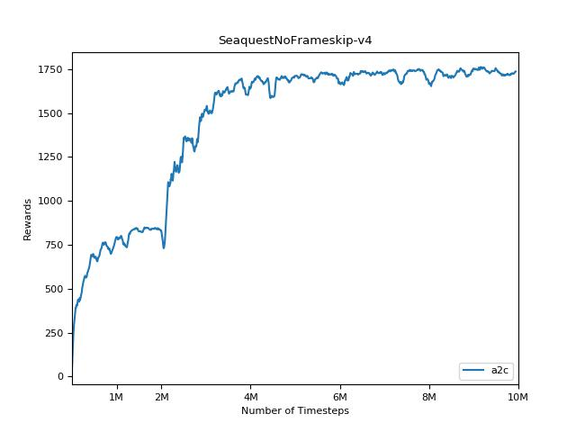
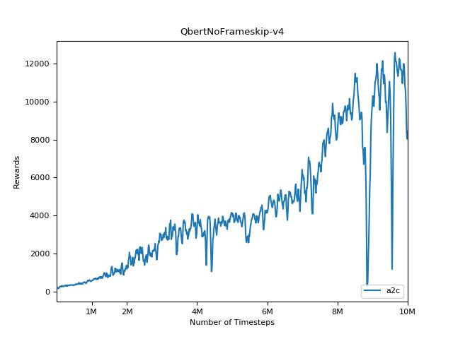

# pytorch-a2c-ppo

This is a PyTorch implementation of Advantage Actor Critic (A2C), a synchronous deterministic version of A3C ["Asynchronous Methods for Deep Reinforcement Learning"](https://arxiv.org/pdf/1602.01783v1.pdf) and [Proximal Policy Optimization (PPO)](https://arxiv.org/pdf/1707.06347.pdf). Also see the OpenAI posts: [A2C/A3C](https://blog.openai.com/baselines-acktr-a2c/) and [PPO](https://blog.openai.com/openai-baselines-ppo/) for more information.

This implementation is inspired by the OpenAI baselines for [A2C](https://github.com/openai/baselines/tree/master/baselines/a2c) and [PPO](https://github.com/openai/baselines/tree/master/baselines/ppo1). It uses the same hyper parameters and the model since they were well tuned for Atari games.

## Contributions

Contributions are very welcome. If you know how to make this code better, don't hesitate to send a pull request.

## Usage

### A2C
```
python main.py --env-name "PongNoFrameskip-v4"
```

### PPO

```
python main.py --env-name "PongNoFrameskip-v4" --algo ppo --use-gae --num-processes 8 --num-steps 256 --vis-interval 1 --log-interval 1
```

## Results

### A2C







### PPO

Coming soon.
